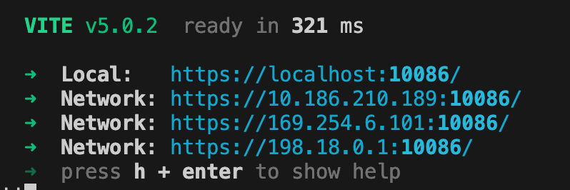

This repository demonstrates a very simple setup, using Vite and React XR, to
bring your display into the WebXR session, and enable truly fast iteration.

### Prerequisite

When you test this project, please make sure your computer and the HMD device are connected to the same WiFi. 
You can simply open hotspot data from your phone and connect both your laptop and the headset to it.

### Setup

##### Configuring Vite

`npm install vite`
`npm install .`

### Launch

Run the below command in the terminal

`npx vite`

------

then you will see the terminal output like this

### How to open in the headset?

1. Choose one of the `Network` URLs (e.g. https://10.186.210.189:10086/)
2. Open https://10.186.210.189:10086/ in Meta Quest Browser
3. In HMD, click `enter AR/enter VR` button
4. Now you can enjoy this fantastic application🎉
5. Above is one default webxr application. You can also open `URL/handlers.html` (e.g.  https://10.186.210.189:10086/handlers.html) or  URL/freehand.html(e.g.  https://10.186.210.189:10086/freehand.html), then it will launch the corresponding webxr application.

### Feature

##### Object manipulation

1. Drag
2. Rotate
3. Scale

### Key Files

This project includes a simple 3D scene to provide some context when demonstrating the result.

The key files implementing the remote display logic are:

- `EnhancedRayGrab.jsx`, define all the hand interaction and the object manipulation logic

‼️To quickly understand the framework and structure of this project, I recommend looking at `src\ARApp.tsx` first.

If you still have more questions, feel free to contact me.😊

### WIsh for more stars🌟! 

Thank you!

